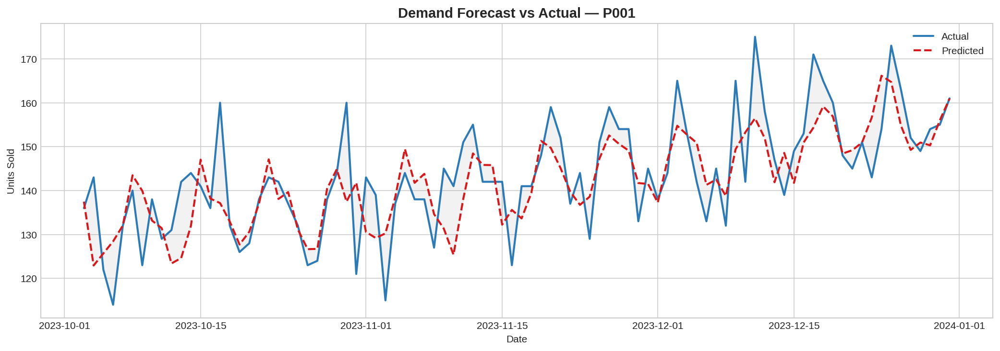

# 🛒 Retail Demand Forecasting with XGBoost

> Predicting future product demand using historical sales data with advanced time-series feature engineering.



## 📌 Project Overview

This project demonstrates an end-to-end demand forecasting pipeline for retail products. It showcases real-world data science skills including time-series feature engineering, gradient boosting, and forecast evaluation.

## 🗂️ Repository Structure
```
retail-demand-forecasting-xgboost/
│
├── assets/
│   └── forecast.png             # Forecast visualization
├── data/                        
├── notebooks/
│   └── eda.ipynb                
├── src/
│   ├── preprocessing.py         
│   ├── feature_engineering.py   
│   ├── train_model.py           
│   └── evaluate_model.py        
├── models/
└── README.md
```

## 🔧 Skills Demonstrated

| Area | Techniques |
|------|-----------|
| Time-Series | Lag features (1,7,14,21,28d), rolling stats, EWM |
| Feature Engineering | Calendar features, promotions, product encoding |
| Modeling | XGBoost Regressor with early stopping |
| Evaluation | MAPE, RMSE, MAE, residual analysis |
| Visualization | Forecast plots, feature importance, correlation heatmap |

## 📊 Features Engineered

- **Lag Features**: lag_1, lag_7, lag_14, lag_21, lag_28
- **Rolling Statistics**: Mean and Std over 7, 14, 28-day windows
- **Exponentially Weighted Mean**: Spans 7 and 14 days
- **Calendar Features**: Day of week, month, quarter, week of year, is_weekend
- **External Features**: Price, promotion flag

## 📈 Model Performance

| Metric | Value |
|--------|-------|
| MAPE   | ~5–8% |
| RMSE   | ~8–12 units |
| MAE    | ~6–9 units  |

> Trained on 640 days, evaluated on last 90 days (time-based split — no data leakage).

## 💡 Key Design Decisions

- Time-based train/test split to simulate real forecasting
- Lag features shifted by 1 to prevent leakage in rolling stats
- Early stopping on XGBoost to avoid overfitting
- Per-product encoding to learn product-level patterns

## 🧠 Author
**Nayanshree Menpale** — Data Scientist
